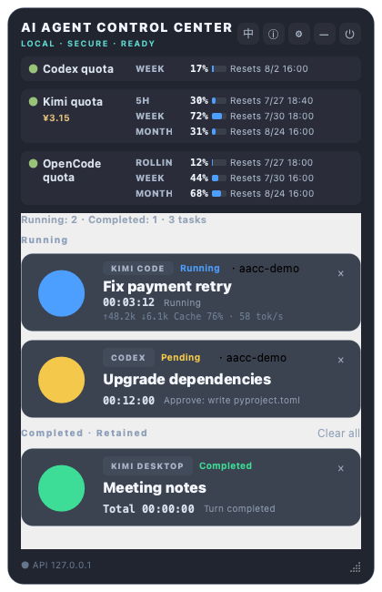

# AI Agent Control Center (AACC)

> A local-first desktop control center for the AI coding agents you choose to monitor, supporting macOS 13+ and Windows 10+.

[中文文档](README.zh-CN.md) · [Download AACC 1.4.4-rc.1](https://github.com/zhangboqian2022/AI-Agent-Control-Center/releases/tag/v1.4.4-rc.1) · [Release notes](docs/release-notes-1.4.4rc1.md) · [Product design](docs/product-design.md)

AACC is a floating cross-platform panel for monitoring local AI coding-agent tasks. It discovers Codex tasks from local metadata, lets you choose exactly which tasks to monitor, and presents each selected task with a large, glanceable state light. It also supports configurable CLI agents, a localhost API, a command-line client, and conservative platform-specific focus/input automation.



_AACC 1.4.4-rc.1 illustrative UI with synthetic demo data; no real account or task data._

  

## Highlights

- **Automatic active-task discovery.** Recent, verified running Codex tasks appear automatically; mute any task you do not want AACC to observe.
- **Results stay visible.** Completed, failed, stopped, and cancelled Codex tasks stay on the panel until you remove them, so a green result light is never lost automatically.
- **Fast visual scanning.** Large status lights distinguish running, waiting, completed, warning, error, and unknown states.
- **Compact multi-agent cards.** A small agent badge identifies Codex or a configured adapter, while the larger task name, whole-run timer, and short activity label remain easy to scan.
- **Adaptive desktop footprint.** The panel grows or shrinks with monitored tasks and switches to internal scrolling at 80% of the current screen's available height.
- **Live Chinese/English UI.** On first launch AACC follows the system language; the header `EN`/`中` action switches the complete UI immediately on macOS and Windows, and an explicit selection persists. Compact mode remains in Settings and the tray menu. Switching language does not refresh quotas or change monitored tasks or login state.
- **Unambiguous exit controls.** The header power button exits the complete application. On Windows, left-clicking the tray icon shows or hides AACC; right-click opens the persistent menu and **Quit AACC** exits all AACC background services.
- **Timely private summaries.** Codex metadata is checked every five seconds and reduced to fixed labels such as “editing code” or “running tests,” without displaying raw payload content.
- **Quota resets at a glance.** Codex shows its 10080-minute `WEEK` window; Kimi shows `5H`, `WEEK`, and `MONTH`. OpenCode shows the Go-plan rolling/weekly/monthly quota. Every available reset is an absolute local date and time inside the row; a real `0%` stays `0%`, and only unknown data becomes `--`.
- **OpenCode Go-plan quota bar.** macOS uses a self-owned web view; Windows uses a separate AACC-owned Microsoft Edge profile with CDP. Both sign you into opencode.ai (GitHub/Google), extract the rendered quota bars from the /go workspace page, and display rolling/weekly/monthly quota (percentage + reset countdown) in a three-row strip. No prompt, reply, tool command, or reasoning content is ever read. Configure `opencode_workspace_url` in `config.yaml`.
- **OpenCode CLI task discovery.** AACC polls opencode's local SQLite database read-only every 5 s and infers monitored status from part snapshots: active streaming or an in-flight turn (even a slow or stuck one) while the process lives → blue ("running"), explicit completion → green ("completed"), and process disappearance without completion → stopped (never falsely completed). Permission prompts are never persisted by opencode, so they cannot be inferred and never surface as a false yellow "waiting" state. Windows resolves `%LOCALAPPDATA%\opencode\opencode.db` first and binds terminal focus to the session work directory. Only part type/status/timestamp are read — never text content.
- **Cached Kimi membership quota.** On Windows, the first sign-in opens Microsoft Edge with an isolated AACC-owned Edge profile at `%LOCALAPPDATA%\AACC\kimi-edge-profile`; it never reads the normal Edge profile. The dedicated session survives AACC and PC restarts until you sign out, Kimi expires it, or a security check fails. macOS keeps its native per-application web session. AACC stores only a protected reuse decision and never copies a cookie, password, website bearer token, account name, or quota value into configuration. Kimi Code OAuth credentials are stored separately under AACC credential protection. The web source and Kimi Code fallback start in the same five-minute cycle. These metadata-only lookups send no prompt and use no generation tokens.
- **Local-first by design.** AACC reads only the local task metadata needed for status detection and never uploads task content.
- **Reliable status boundaries.** Codex session `task_started` and `task_complete` events take priority over file activity to avoid stale “running” indicators.
- **Visible discovery health.** Repeated Codex metadata errors show a recoverable warning banner with sanitized diagnostics instead of silently freezing task state.
- **Responsive, serialized control.** Complete focus-and-input transactions run in a bounded worker so concurrent calls cannot inject into the wrong window and the panel stays responsive.
- **Desktop control without blind input.** Cards select a task; the explicit context action focuses the target app. Keyboard injection is restricted to a small allowlist.
- **Extensible integration.** Use the local API, `aacc` CLI, `aacc-run` wrapper, or configurable adapters for Codex CLI/App, Claude Code, Kimi Code, and generic CLIs. Non-native adapters provide conservative process-level running/stopped evidence; they do not claim agent-specific completion semantics.

## Install

### Recommended: download the RC DMG

Download [AACC-1.4.4-rc.1.dmg](https://github.com/zhangboqian2022/AI-Agent-Control-Center/releases/download/v1.4.4-rc.1/AACC-1.4.4-rc.1.dmg), open it, and drag `AACC.app` to Applications.

This community build is not Developer ID-signed and is not notarized by Apple. Depending on the build keychain, the app may carry an ad-hoc signature or the local-development self-signature; neither establishes Apple distribution trust. First download the matching `.dmg.sha256` asset and compare it with:

```bash
shasum -a 256 AACC-1.4.4-rc.1.dmg
```

Only after the checksum matches, use **System Settings → Privacy & Security → Open Anyway** if macOS blocks the first launch. If that documented path still fails, the last-resort local quarantine removal is:

```bash
xattr -cr /Applications/AACC.app
```

Developer ID signing and Apple notarization are planned once a paid developer account is available.

### Build from source

Requirements: macOS 13+ and [uv](https://docs.astral.sh/uv/).

```bash
git clone https://github.com/zhangboqian2022/AI-Agent-Control-Center.git
cd AI-Agent-Control-Center
./scripts/install.sh
```

The installer skips tests by default (set `AACC_RUN_TESTS=1` to run them first), builds `AACC.app`, installs it under `~/Applications/AACC.app`, creates a production-only CLI runtime under `~/Library/Application Support/AACC/runtime`, and adds `aacc` and `aacc-run` to `~/.local/bin`.

To create a distributable image:

```bash
./scripts/build_dmg.sh
```

### Windows 1.4.4-rc.1

The primary Windows RC download is [`AACC-1.4.4rc1-Setup.exe`](https://github.com/zhangboqian2022/AI-Agent-Control-Center/releases/download/v1.4.4-rc.1/AACC-1.4.4rc1-Setup.exe), accompanied by `AACC-1.4.4rc1-Setup.exe.sha256`.

This per-user Setup installs for the current user without administrator elevation at `%LocalAppData%\Programs\AACC`. It always adds a Start Menu shortcut, offers an unchecked desktop shortcut, and adds no login item. Run the same Setup to upgrade in place; uninstall removes the program and shortcuts. Both upgrade and uninstall preserve AACC-owned data under `%APPDATA%\AACC`, including settings, history, database, credentials, and the protected Kimi reuse decision.

Windows Kimi login uses the installed Microsoft Edge browser with an AACC-owned Edge profile at `%LOCALAPPDATA%\AACC\kimi-edge-profile`; Setup does not install a separate browser runtime. Sign in once in the dedicated Edge window. AACC then closes that managed window and reuses the isolated session for five-minute background quota refreshes until you sign out or Kimi expires the session. AACC never reads the normal Edge profile.

Windows OpenCode quota uses a different AACC-owned Edge profile at `%LOCALAPPDATA%\AACC\opencode-edge-profile`; it never shares Kimi's profile. The OpenCode CLI database is discovered from `%LOCALAPPDATA%\opencode\opencode.db` (with documented profile fallback locations), and the task card shows its session work-directory name when available.

The Windows build is not Authenticode-signed, so Windows may show an Unknown publisher or SmartScreen warning. Verify the matching SHA-256 before choosing **More info → Run anyway**:

```powershell
(Get-FileHash .\AACC-1.4.4rc1-Setup.exe -Algorithm SHA256).Hash
Get-Content .\AACC-1.4.4rc1-Setup.exe.sha256
```

Sensitive configuration, database, and credential files use a native protected DACL limited to the current user, Local System, and Administrators. Packaged Codex quota queries run through a fixed-purpose broker beside `AACC.exe`; the broker accepts only the read-only Codex app-server command and contains its process tree. Hosted Windows Server 2022/2025 product tests passed; this does not claim completed consumer Windows 10/11 manual verification.

Developers can still build the onedir payload from source with Python 3.12+, [uv](https://docs.astral.sh/uv/), and `.\scripts\build_windows.ps1`. The portable bundle is a CI/debugging artifact, not the primary user download.

Capability comparison with the macOS build:

| Capability | macOS | Windows |
| --- | --- | --- |
| Window focus | Bundle ID + AppleScript | Window-title matching (no bundle ID) |
| Voice input | macOS dictation | Win+H |
| Accessibility permission | Required for injection and hotkeys | Not required |
| Signing | No Developer ID / no notarization; ad-hoc or local-development signature | No Authenticode signature; SmartScreen prompt |

## Use AACC with Codex

1. Launch AACC. Open its settings with the gear icon.
2. Recent, verified running Codex tasks are automatically checked and added to the panel (up to four at a time).
3. Open **Choose Codex tasks to monitor** to keep inactive tasks manually, or uncheck an automatic task to mute it. Use **Restore automatic detection** to undo mutes.
4. A completed task stays in the retained section with its terminal status light. Use its `×`, the **Remove from panel** context action, or confirmed **Clear retained tasks** to remove it.
5. If a removed task has verified new activity later, AACC automatically shows it again.
6. Drag the panel to a fixed location; use settings to toggle always-on-top and return it to the desktop’s top-right corner.

A single click selects a card and keeps AACC visible. Use the card’s context menu and **Switch to task** when you intentionally want to focus Codex.

For selected Codex sessions, AACC reads task IDs, titles, timestamps, session-file modification times, event names, matching process identifiers, and a bounded recent tool-event category. It may inspect command category markers to distinguish tests and builds, but never copies raw prompts, responses, commands, credentials, code, or file contents into the panel, task history, or logs. A historical `task_started` event without recent activity is deliberately treated as unknown rather than running. See the [English user guide](docs/user-guide.en.md) or [中文用户指南](docs/user-guide.md).

The Codex quota strip is weekly-only. Its primary source starts the installed Codex `app-server` locally and calls only the read-only `account/rateLimits/read` method using the account already configured in Codex; it does not start a task, send a prompt, or initiate a login. AACC rediscovers that live source every 60 seconds, so ChatGPT/Codex opened or restarted after AACC can synchronize without restarting AACC; click the strip for an immediate refresh. AACC accepts only a future 10080-minute window. If that method or executable is unavailable, it falls back to bounded tails of recent local session files and ignores legacy shorter windows. A temporary refresh failure preserves the last valid value and marks it stale; `--` is used only before any valid value is available.

Kimi renders `5H`, `WEEK`, and `MONTH`. A real `0%` is rendered as `0%`. A known percentage with no trustworthy reset time keeps the percentage and shows `--` for its reset. Temporary background failures retain the last verifiable `5H`/`WEEK` values as stale and replace them automatically after a successful refresh. Native-session persistence and logout across restart remain listed in the manual verification checklists.

## CLI and local API

Use the wrapper for process lifecycle reporting or update a task directly:

```bash
aacc-run --task task-1 -- codex
aacc status task-1 running --message "Analyzing the repository"
aacc status task-1 waiting-approval --message "Waiting for approval"
aacc status task-1 completed --message "Changes complete"
aacc list
aacc doctor
```

The API is bound only to loopback (`http://127.0.0.1:17650` or
`http://[::1]:17650`) and requires a random token generated in the local config
file. It is intentionally not a remote-control API.

Use **Settings → Reset API credentials** to rotate the token locally. The previous token becomes invalid immediately and the new token is copied once. Keyboard injection and global hotkeys require macOS Accessibility permission; AACC detects a missing permission and opens the correct System Settings pane on request.

⚠️ **Security warning for `/send-text`:** the API token grants keyboard-equivalent text injection. If the token is leaked, an attacker who can call the local API can combine arbitrary text with the allowlisted `Enter` key and execute commands in a terminal-like target. Treat this token as a password-grade secret.

## Architecture and privacy

```text
Selected local agent tasks
          ↓
Task discovery / adapters / CLI wrapper
          ↓
State manager + SQLite history + confidence rules
          ↓
Floating PySide6 panel · menu bar · localhost API
```

Task discovery, adapters, state management, UI, API, and macOS automation are isolated modules. AACC prefers structured local events; when confidence is insufficient it reports `UNKNOWN` or `WARNING` rather than inventing a result.

Security boundaries:

- Loopback-only API with a random Bearer token.
- No arbitrary shell command endpoint and no `shell=True` subprocess calls.
- Allowed injected keys are limited to Enter, Esc, arrows, Ctrl+C, `1`, and `2`.
- `/send-text` plus the allowlisted `Enter` key is equivalent to interactive typing in a terminal target; protect the API token accordingly.
- Target app/window activation must succeed before input is sent.
- Logs redact common tokens, passwords, and Authorization headers.

Read the full [product design](docs/product-design.md), [security policy](SECURITY.md), [known limitations](KNOWN_LIMITATIONS.md), and [troubleshooting guide](docs/troubleshooting.en.md).

## Development

```bash
uv run pytest -q
uv run ruff check src tests
uv run mypy src
./scripts/start.sh
```

See [adapter development](docs/adapter-development.en.md) to add a supported agent without coupling it to the UI.

## Contributing and community

Issues and pull requests are welcome. Please read [CONTRIBUTING.md](CONTRIBUTING.md), [CODE_OF_CONDUCT.md](CODE_OF_CONDUCT.md), and [SECURITY.md](SECURITY.md) before participating.

Author and maintainer: **zhangboqian** · <zhangboqian@hotmail.com> · [Changelog](CHANGELOG.md)

## Attribution

The product design of the Kimi quota monitoring and session metrics features was informed by the following open-source projects, with some logic adapted:
[MoonshotAI/kimi-code](https://github.com/MoonshotAI/kimi-code) (official OAuth flow and quota API conventions),
[KimiCodeBar](https://github.com/xifandev/KimiCodeBar) (booster-wallet parsing and credential isolation design),
[kimi-code-monitor](https://github.com/bfjnbvf/kimi-code-monitor) (per-session token metric algorithms).
All three are released under the MIT License; this project complies with that license
and retains each author's copyright notice. See [NOTICE](NOTICE) for details.

## License

Copyright © 2026 zhangboqian. Released under the [MIT License](LICENSE).
