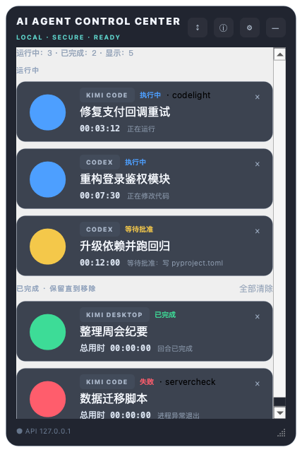

# AI Agent Control Center（AACC）

> 面向本机 AI Coding Agent 的 macOS 桌面状态与控制中心。

[English README](README.md) · [下载 AACC 1.4.0-rc.2](https://github.com/zhangboqian2022/AI-Agent-Control-Center/releases/download/v1.4.0-rc.2/AACC-1.4.0-rc.2.dmg) · [发布说明](https://github.com/zhangboqian2022/AI-Agent-Control-Center/releases/tag/v1.4.0-rc.2) · [产品设计](docs/product-design.zh-CN.md)

AACC 是一个本机优先的 macOS 悬浮面板，用于查看你选择监控的 AI 编程任务。它从本机 Codex 元数据自动发现对话，让你筛选需要展示的任务，并通过醒目的大状态灯快速显示运行、等待、完成、告警、错误或未知状态。它还提供本地 API、`aacc` 命令行、`aacc-run` 生命周期包装器和可配置的 Agent Adapter。



## 核心能力

- **运行任务自动发现：** 有近期可靠运行证据的 Codex 任务会自动出现；不想观察的任务可随时取消自动监控。
- **完成结果保留：** Codex 任务完成、失败、停止或取消后仍留在面板，状态灯不会自动消失，直到你主动移除。
- **醒目状态灯：** 通过大尺寸灯光快速识别任务状态，避免错过正在等待处理的任务。
- **紧凑多工具卡片：** Codex 或已配置 Adapter 以小徽标标识，任务名称更大，并显示完整运行计时与一行短状态。
- **面板自动伸缩：** 任务增加或移除时窗口自动拉长或收短；达到当前屏幕可用高度的 80% 后改为内部滚动。
- **及时且克制的概括：** 每 5 秒检查 Codex 元数据，用“正在修改代码”“正在运行测试”等固定短语反馈活动，不展示原始载荷。
- **本机优先：** 只读取判断状态所需的本机任务元数据，不上传对话内容。
- **可靠的完成判断：** 优先依据 Codex `task_started` 与 `task_complete` 会话事件，避免任务完成后仍错误显示“执行中”。
- **发现故障可见：** Codex 元数据连续读取失败时显示可恢复的黄色告警条，不再静默冻结旧状态。
- **控制串行且界面流畅：** 聚焦与输入作为完整事务进入有界工作线程，并发调用不会错窗，面板也不会被阻塞。
- **克制的桌面控制：** 单击卡片只选中任务；只有右键菜单的“切换到任务”才会聚焦 Codex。按键输入仅允许白名单按键。
- **可扩展接入：** 支持 Codex CLI/App、Claude Code、Kimi Code、通用 CLI，以及本地 API、CLI 和包装器接入。

## 安装

### 推荐：下载 DMG

下载 [AACC-1.4.0-rc.2.dmg](https://github.com/zhangboqian2022/AI-Agent-Control-Center/releases/download/v1.4.0-rc.2/AACC-1.4.0-rc.2.dmg)，打开后把 `AACC.app` 拖入“应用程序”文件夹。

此版本使用本地自签名证书签名，尚未经过 Apple 公证。若首次启动被 macOS 拦截，请先核对 Release 校验值，再在"系统设置 → 隐私与安全性"选择"仍要打开"。待取得付费开发者账号后将切换为 Developer ID 签名与 Apple 公证。

### 从源码构建

要求 macOS 13+ 与 [uv](https://docs.astral.sh/uv/)。

```bash
git clone https://github.com/zhangboqian2022/AI-Agent-Control-Center.git
cd AI-Agent-Control-Center
./scripts/install.sh
```

安装脚本默认跳过测试（先设 `AACC_RUN_TESTS=1` 才会在安装前运行）、构建 `AACC.app`、安装到 `~/Applications/AACC.app`，并在 `~/Library/Application Support/AACC/runtime` 创建不含开发依赖的 CLI 运行环境，再将命令链接到 `~/.local/bin`。

制作分发镜像：

```bash
./scripts/build_dmg.sh
```

## 用 Codex 任务

1. 启动 AACC，点击右上角齿轮打开设置。
2. 有近期可靠运行证据的 Codex 任务会自动勾选并加入面板（最多同时 4 个）。
3. 点击“选择监控的 Codex 任务”，可手工保留非运行任务；取消自动任务的勾选会静默该任务。需要恢复时点击“恢复自动识别”。
4. 任务完成后会保留在“已完成”区域。点击卡片 `×`、右键“从面板移除”，或确认“全部清除”才会移除。
5. 已移除任务若再次有可靠运行活动，会自动重新出现。
6. 将面板拖到固定位置；在设置中选择是否始终置顶，或恢复到桌面右上角。

单击卡片只会选中任务，不会隐藏 AACC。需要切换到 Codex 时，使用卡片右键菜单的“切换到任务”。

对已选择的 Codex 会话，AACC 读取任务 ID、标题、更新时间、会话文件修改时间、事件名、匹配进程标识及有界的近期工具事件类别。为了区分测试与构建，它可能检查命令类别标记，但不会把原始提示词、回答、命令、凭证、代码或文件内容复制到面板、任务历史或日志。只有历史 `task_started` 且没有近期活动时会诚实显示未知状态，不会误报为运行。详见[中文用户指南](docs/user-guide.md)或 [English user guide](docs/user-guide.en.md)。

## CLI 与本地 API

可用包装器报告进程生命周期，或直接更新任务：

```bash
aacc-run --task task-1 -- codex
aacc status task-1 running --message "正在分析仓库"
aacc status task-1 waiting-approval --message "等待批准"
aacc status task-1 completed --message "修改完成"
aacc list
aacc doctor
```

API 只绑定在 `http://127.0.0.1:17650`，使用写入本机配置的随机 Token；它不是远程控制 API。

可在“设置 → 重置 API 凭证”本地轮换 Token；旧 Token 立即失效，新 Token 只复制一次。键盘输入与全局热键需要 macOS 辅助功能权限，AACC 会检测缺失权限并可跳转到正确的系统设置页面。

## 架构与隐私

```text
已选择的本机 Agent 任务
          ↓
任务发现 / Adapter / CLI 包装器
          ↓
状态管理器 + SQLite 历史 + 可信度规则
          ↓
PySide6 悬浮面板 · 菜单栏 · localhost API
```

任务发现、Adapter、状态管理、GUI、API 与 macOS 自动化彼此隔离。AACC 优先使用结构化本机事件；可信度不足时会显示 `UNKNOWN` 或 `WARNING`，不会虚构结果。

安全边界：

- API 只允许 `127.0.0.1`，并使用随机 Bearer Token。
- 不提供任意 shell 命令接口，子进程不使用 `shell=True`。
- 注入按键仅限 Enter、Esc、方向键、Ctrl+C、`1`、`2`。
- 发送按键前必须成功激活目标 App/窗口。
- 日志会脱敏常见 Token、密码和 Authorization 头。

参阅完整[产品设计](docs/product-design.zh-CN.md)、[安全策略](SECURITY.md)、[已知限制](KNOWN_LIMITATIONS.zh-CN.md)和[故障排查](docs/troubleshooting.md)。

## 开发

```bash
uv run pytest -q
uv run ruff check src tests
uv run mypy src
./scripts/start.sh
```

新增 Agent 时请阅读 [Adapter 开发指南](docs/adapter-development.md) / [Adapter development](docs/adapter-development.en.md)。

## 贡献与社区

欢迎提交 Issue 和 Pull Request。参与前请阅读 [CONTRIBUTING.md](CONTRIBUTING.md)、[CODE_OF_CONDUCT.md](CODE_OF_CONDUCT.md) 与 [SECURITY.md](SECURITY.md)。

作者与维护者：**zhangboqian** · <zhangboqian@hotmail.com> · [更新日志](CHANGELOG.zh-CN.md)

## 致谢

Kimi 额度监控与会话指标功能的产品设计参考了以下开源项目，并移植了部分逻辑：
[MoonshotAI/kimi-code](https://github.com/MoonshotAI/kimi-code)（官方 OAuth 流程与额度接口约定）、
[KimiCodeBar](https://github.com/xifandev/KimiCodeBar)（加油包解析与凭据隔离设计）、
[kimi-code-monitor](https://github.com/bfjnbvf/kimi-code-monitor)（会话 token 指标算法）。
这些项目均采用 MIT 开源许可协议；本项目遵从该协议，保留了各原作者的版权声明，
详见 [NOTICE](NOTICE)。

## 许可证

Copyright © 2026 zhangboqian。项目以 [MIT License](LICENSE) 开源。
