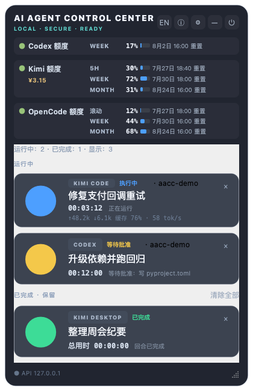

# AI Agent Control Center（AACC）

> 面向本机 AI Coding Agent 的桌面状态与控制中心，支持 macOS 13+ 与 Windows 10+。

[English README](README.md) · [下载 AACC 1.4.4-rc.1](https://github.com/zhangboqian2022/AI-Agent-Control-Center/releases/tag/v1.4.4-rc.1) · [发布说明](docs/release-notes-1.4.4rc1.md) · [产品设计](docs/product-design.zh-CN.md)

AACC 是一个本机优先的跨平台悬浮面板，用于查看你选择监控的 AI 编程任务。它从本机 Codex 元数据自动发现对话，让你筛选需要展示的任务，并通过醒目的大状态灯快速显示运行、等待、完成、告警、错误或未知状态。它还提供本地 API、`aacc` 命令行、`aacc-run` 生命周期包装器和可配置的 Agent Adapter。



_AACC 1.4.4-rc.1 界面示意图，使用合成演示数据，不含真实账户或任务数据。_

  

## 核心能力

- **运行任务自动发现：** 有近期可靠运行证据的 Codex 任务会自动出现；不想观察的任务可随时取消自动监控。
- **完成结果保留：** Codex 任务完成、失败、停止或取消后仍留在面板，状态灯不会自动消失，直到你主动移除。
- **醒目状态灯：** 通过大尺寸灯光快速识别任务状态，避免错过正在等待处理的任务。
- **紧凑多工具卡片：** Codex 或已配置 Adapter 以小徽标标识，任务名称更大，并显示完整运行计时与一行短状态。
- **面板自动伸缩：** 任务增加或移除时窗口自动拉长或收短；达到当前屏幕可用高度的 80% 后改为内部滚动。
- **中英文即时切换：** 首次启动跟随系统语言；面板头部的 `EN`/`中` 操作可在 macOS 与 Windows 上立即切换完整界面，明确选择会持久保存。紧凑模式保留在设置和托盘菜单。切换语言不会刷新额度，也不会改变监控任务或登录状态。
- **明确的退出入口：** 头部电源按钮会完整退出应用。Windows 托盘图标左键显示/隐藏 AACC，右键打开持续可用的菜单，其中“退出 AACC”会关闭全部 AACC 后台服务。
- **及时且克制的概括：** 每 5 秒检查 Codex 元数据，用“正在修改代码”“正在运行测试”等固定短语反馈活动，不展示原始载荷。
- **额度与重置时间一眼可见：** Codex 只显示 10080 分钟 `WEEK` 周窗口；Kimi 按 `5H`、`WEEK`、`MONTH` 显示；OpenCode 显示 Go 套餐滚动/每周/每月额度。每个可用重置时间都直接写在行内；真实 `0%` 明确显示为 `0%`，只有未知数据才显示 `--`。
- **OpenCode Go 套餐额度条：** macOS 使用自持网页视图，Windows 使用独立的 AACC 专用 Microsoft Edge 配置目录和 CDP；两边都登录 opencode.ai（GitHub/Google），从 /go 工作区页面提取已渲染的滚动/每周/每月额度（百分比 + 重置倒计时），三行展示在 Kimi 额度条下方。绝不读取 prompt、回复、工具命令或 reasoning 内容。在 `config.yaml` 配置 `opencode_workspace_url`。
- **OpenCode CLI 任务发现：** 每 5 秒只读轮询 opencode 本地 SQLite 数据库，从消息部件快照推断任务状态：进程在且回合未结束（含缓慢或卡住的流式生成）→ 蓝灯“进行中”；有明确完成证据 → 绿灯“已完成”；进程消失但没有完成证据 → 停止态，不伪造完成。opencode 不会把权限请求写入数据库，因此无法推断授权等待，也永不误报黄色“等待”状态。Windows 优先读取 `%LOCALAPPDATA%\opencode\opencode.db`，并按会话工作目录定位终端。只读取部件类型/状态/时间戳——绝不读取文本内容。
- **Kimi 会员额度缓存：** Windows 首次登录会用隔离的 AACC 专用 Edge 配置目录 `%LOCALAPPDATA%\AACC\kimi-edge-profile` 打开 Microsoft Edge，绝不读取日常 Edge 配置。该独立会话会跨 AACC 和电脑重启保留，直到手动退出、Kimi 令其失效或安全检查失败；macOS 继续使用系统原生的每应用网页会话。AACC 只保存受保护的复用决定，不把 Cookie、密码、网页 Bearer Token、账户名或额度值复制进配置；Kimi Code OAuth 凭据由 AACC 凭据保护另行保存。网页源与 Kimi Code 备用源从同一个五分钟周期开始刷新；查询不消耗生成 Token。
- **本机优先：** 只读取判断状态所需的本机任务元数据，不上传对话内容。
- **可靠的完成判断：** 优先依据 Codex `task_started` 与 `task_complete` 会话事件，避免任务完成后仍错误显示“执行中”。
- **发现故障可见：** Codex 元数据连续读取失败时显示可恢复的黄色告警条，不再静默冻结旧状态。
- **控制串行且界面流畅：** 聚焦与输入作为完整事务进入有界工作线程，并发调用不会错窗，面板也不会被阻塞。
- **克制的桌面控制：** 单击卡片只选中任务；只有右键菜单的“切换到任务”才会聚焦 Codex。按键输入仅允许白名单按键。
- **可扩展接入：** 支持 Codex CLI/App、Claude Code、Kimi Code、通用 CLI，以及本地 API、CLI 和包装器接入。非原生 Adapter 只提供保守的进程级运行/停止证据，不声称具备 Agent 专属的完成语义。

## 安装

### 推荐：下载 RC DMG

下载 [AACC-1.4.4-rc.1.dmg](https://github.com/zhangboqian2022/AI-Agent-Control-Center/releases/download/v1.4.4-rc.1/AACC-1.4.4-rc.1.dmg)，打开后把 `AACC.app` 拖入“应用程序”文件夹。

此社区版本没有 Developer ID 签名，也没有经过 Apple 公证。根据构建时的钥匙串环境，App 可能带有 ad-hoc 签名或本地开发自签名；这两者都不等于 Apple 分发信任。请先下载配套的 `.dmg.sha256` 资产，并对比：

```bash
shasum -a 256 AACC-1.4.4-rc.1.dmg
```

仅在校验值一致后，若 macOS 拦截首次启动，再到“系统设置 → 隐私与安全性”选择“仍要打开”。如果该标准路径仍失败，最后才在本机移除隔离属性：

```bash
xattr -cr /Applications/AACC.app
```

待取得付费开发者账号后将切换为 Developer ID 签名与 Apple 公证。

### 从源码构建

要求 macOS 13+ 与 [uv](https://docs.astral.sh/uv/)。

```bash
git clone https://github.com/zhangboqian2022/AI-Agent-Control-Center.git
cd AI-Agent-Control-Center
./scripts/install.sh
```

安装脚本默认跳过测试（先设 `AACC_RUN_TESTS=1` 才会在安装前运行）、构建 `AACC.app`、安装到 `~/Applications/AACC.app`，并在 `~/Library/Application Support/AACC/runtime` 创建不含开发依赖的 CLI 运行环境，再将命令链接到 `~/.local/bin`。

制作分发镜像：

```bash
./scripts/build_dmg.sh
```

### Windows 1.4.4-rc.1

Windows RC 主下载文件是 [`AACC-1.4.4rc1-Setup.exe`](https://github.com/zhangboqian2022/AI-Agent-Control-Center/releases/download/v1.4.4-rc.1/AACC-1.4.4rc1-Setup.exe)，并配套 `AACC-1.4.4rc1-Setup.exe.sha256`。

Setup 只安装给当前用户，无需管理员提权，默认路径为 `%LocalAppData%\Programs\AACC`。安装器始终创建开始菜单快捷方式，可选但默认不勾选桌面快捷方式，不添加开机启动项。再次运行同一个 Setup 可原位升级；卸载会移除程序与快捷方式。升级和卸载都会保留 `%APPDATA%\AACC` 下由 AACC 管理的设置、历史、数据库、凭据和 Kimi 复用决定。

Windows Kimi 登录使用系统已安装的 Microsoft Edge，并把会话隔离在 AACC 专用 Edge 配置目录 `%LOCALAPPDATA%\AACC\kimi-edge-profile`；Setup 不再安装额外浏览器运行时。首次在专用 Edge 窗口登录成功后，AACC 会关闭该窗口，并每五分钟用同一独立会话在后台刷新额度，直到手动退出或 Kimi 令会话失效。AACC 不读取日常 Edge 配置。

Windows OpenCode 额度使用另一套 AACC 专用 Edge 配置目录 `%LOCALAPPDATA%\AACC\opencode-edge-profile`，与 Kimi 完全隔离。OpenCode CLI 优先从 `%LOCALAPPDATA%\opencode\opencode.db` 发现会话（另有用户目录回退位置），并在任务卡有工作目录时展示目录名。

Windows 版本没有 Authenticode 签名，因此 Windows 可能显示“未知发布者”或 SmartScreen 提示。请先核对配套 SHA-256，再选择“更多信息 → 仍要运行”：

```powershell
(Get-FileHash .\AACC-1.4.4rc1-Setup.exe -Algorithm SHA256).Hash
Get-Content .\AACC-1.4.4rc1-Setup.exe.sha256
```

敏感配置、数据库和凭据文件使用原生受保护 DACL，仅允许当前用户、Local System 与 Administrators。打包后的 Codex 额度查询通过 `AACC.exe` 旁的固定用途 broker 启动；broker 只接受只读 Codex app-server 命令，并约束其完整进程树。Windows Server 2022/2025 托管产品测试已通过，但这不代表已完成消费级 Windows 10/11 人工验证。

开发者仍可使用 Python 3.12+、[uv](https://docs.astral.sh/uv/) 和 `.\scripts\build_windows.ps1` 从源码生成 onedir 载荷。portable 包只用于 CI/调试，不是面向普通用户的主下载。

与 macOS 版的能力对照：

| 能力 | macOS | Windows |
| --- | --- | --- |
| 窗口聚焦 | Bundle ID + AppleScript | 窗口标题匹配（无 bundle id） |
| 语音输入 | macOS 听写 | Win+H |
| 辅助功能授权 | 注入/热键需要 | 不需要 |
| 签名 | 无 Developer ID / 未公证；ad-hoc 或本地开发自签名 | 无 Authenticode 签名；SmartScreen 提示 |

## 用 Codex 任务

1. 启动 AACC，点击右上角齿轮打开设置。
2. 有近期可靠运行证据的 Codex 任务会自动勾选并加入面板（最多同时 4 个）。
3. 点击“选择监控的 Codex 任务”，可手工保留非运行任务；取消自动任务的勾选会静默该任务。需要恢复时点击“恢复自动识别”。
4. 任务完成后会保留在“已完成”区域。点击卡片 `×`、右键“从面板移除”，或确认“全部清除”才会移除。
5. 已移除任务若再次有可靠运行活动，会自动重新出现。
6. 将面板拖到固定位置；在设置中选择是否始终置顶，或恢复到桌面右上角。

单击卡片只会选中任务，不会隐藏 AACC。需要切换到 Codex 时，使用卡片右键菜单的“切换到任务”。

对已选择的 Codex 会话，AACC 读取任务 ID、标题、更新时间、会话文件修改时间、事件名、匹配进程标识及有界的近期工具事件类别。为了区分测试与构建，它可能检查命令类别标记，但不会把原始提示词、回答、命令、凭证、代码或文件内容复制到面板、任务历史或日志。只有历史 `task_started` 且没有近期活动时会诚实显示未知状态，不会误报为运行。详见[中文用户指南](docs/user-guide.md)或 [English user guide](docs/user-guide.en.md)。

Codex 额度条只显示周额度。主要数据源是在本机启动已安装的 Codex `app-server`，仅使用 Codex 已配置账户调用只读 `account/rateLimits/read`；不会启动任务、发送提示词或发起登录。AACC 每 60 秒重新发现一次实时来源，因此 ChatGPT/Codex 在 AACC 之后打开或重启也能自动同步，无需重启 AACC；点击额度条可立即刷新。AACC 只接受未来有效的 10080 分钟周窗口。可执行文件或该方法不可用时，才回退扫描近期本机会话文件的有界尾部，并忽略旧版较短窗口。一次临时刷新失败不会清空已有数值，而会保留最后一次有效值并标记“数据过期”；从未取得过有效数据时才显示 `--`。

Kimi 严格显示 `5H`、`WEEK`、`MONTH`。真实 `0%` 显示为 `0%`；百分比已知但没有可信重置时间时，仍显示百分比，重置位置显示 `--`。后台临时刷新失败时保留最后一次可验证的 `5H`/`WEEK` 值并标记“数据过期”，刷新恢复后自动替换。原生会话跨重启保留与退出后仍保持登出继续列在人工验证清单中。

## CLI 与本地 API

可用包装器报告进程生命周期，或直接更新任务：

```bash
aacc-run --task task-1 -- codex
aacc status task-1 running --message "正在分析仓库"
aacc status task-1 waiting-approval --message "等待批准"
aacc status task-1 completed --message "修改完成"
aacc list
aacc doctor
```

API 只绑定在回环地址（`http://127.0.0.1:17650` 或 `http://[::1]:17650`），
使用写入本机配置的随机 Token；它不是远程控制 API。

可在“设置 → 重置 API 凭证”本地轮换 Token；旧 Token 立即失效，新 Token 只复制一次。键盘输入与全局热键需要 macOS 辅助功能权限，AACC 会检测缺失权限并可跳转到正确的系统设置页面。

⚠️ **`/send-text` 安全警告：** API Token 具有等效键盘输入的文本注入权限。Token 泄露后，调用者可把任意文本与白名单中的 `Enter` 组合，在终端类目标中执行命令。请把 Token 按密码级机密保护。

## 架构与隐私

```text
已选择的本机 Agent 任务
          ↓
任务发现 / Adapter / CLI 包装器
          ↓
状态管理器 + SQLite 历史 + 可信度规则
          ↓
PySide6 悬浮面板 · 菜单栏 · localhost API
```

任务发现、Adapter、状态管理、GUI、API 与 macOS 自动化彼此隔离。AACC 优先使用结构化本机事件；可信度不足时会显示 `UNKNOWN` 或 `WARNING`，不会虚构结果。

安全边界：

- API 只允许 `127.0.0.1`，并使用随机 Bearer Token。
- 不提供任意 shell 命令接口，子进程不使用 `shell=True`。
- 注入按键仅限 Enter、Esc、方向键、Ctrl+C、`1`、`2`。
- `/send-text` 配合白名单中的 `Enter` 等效于终端目标中的交互式输入，必须保护好 API Token。
- 发送按键前必须成功激活目标 App/窗口。
- 日志会脱敏常见 Token、密码和 Authorization 头。

参阅完整[产品设计](docs/product-design.zh-CN.md)、[安全策略](SECURITY.md)、[已知限制](KNOWN_LIMITATIONS.zh-CN.md)和[故障排查](docs/troubleshooting.md)。

## 开发

```bash
uv run pytest -q
uv run ruff check src tests
uv run mypy src
./scripts/start.sh
```

新增 Agent 时请阅读 [Adapter 开发指南](docs/adapter-development.md) / [Adapter development](docs/adapter-development.en.md)。

## 贡献与社区

欢迎提交 Issue 和 Pull Request。参与前请阅读 [CONTRIBUTING.md](CONTRIBUTING.md)、[CODE_OF_CONDUCT.md](CODE_OF_CONDUCT.md) 与 [SECURITY.md](SECURITY.md)。

作者与维护者：**zhangboqian** · <zhangboqian@hotmail.com> · [更新日志](CHANGELOG.zh-CN.md)

## 致谢

Kimi 额度监控与会话指标功能的产品设计参考了以下开源项目，并移植了部分逻辑：
[MoonshotAI/kimi-code](https://github.com/MoonshotAI/kimi-code)（官方 OAuth 流程与额度接口约定）、
[KimiCodeBar](https://github.com/xifandev/KimiCodeBar)（加油包解析与凭据隔离设计）、
[kimi-code-monitor](https://github.com/bfjnbvf/kimi-code-monitor)（会话 token 指标算法）。
这些项目均采用 MIT 开源许可协议；本项目遵从该协议，保留了各原作者的版权声明，
详见 [NOTICE](NOTICE)。

## 许可证

Copyright © 2026 zhangboqian。项目以 [MIT License](LICENSE) 开源。
